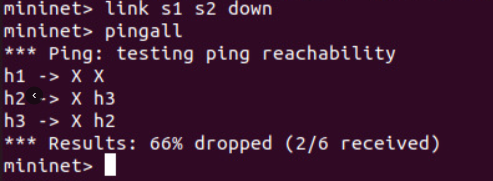
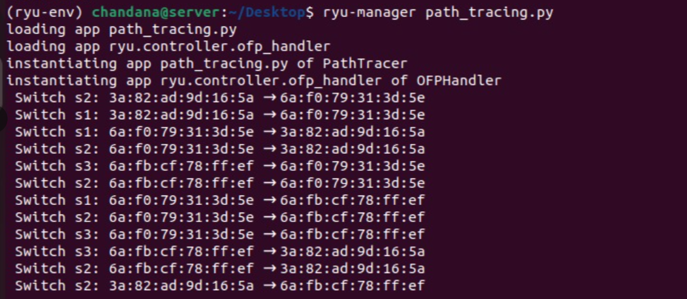
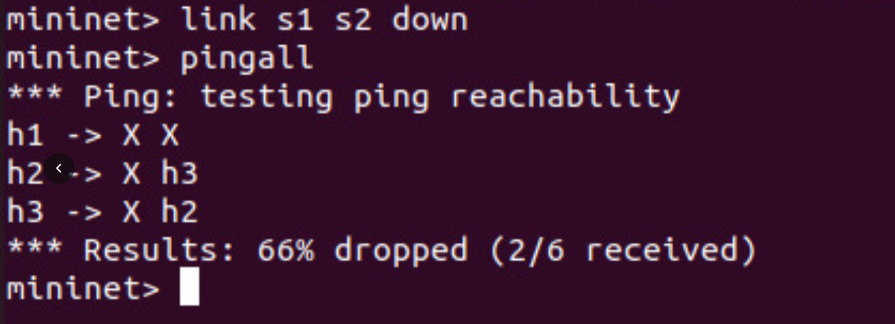

# SDN-Based Path Tracing Tool

**Name:** Chandana Rani S
**SRN:** PES2UG24AM044

---

## 1. Project Overview

This project presents the design and implementation of a Software Defined Networking (SDN) based Path Tracing Tool using the Ryu controller and Mininet emulator. The system enables monitoring of packet flow and provides visibility into how packets traverse through different switches in the network.

The project demonstrates how SDN separates network control from forwarding and enables centralized decision-making through a controller.

---

## 2. Problem Statement

Traditional networks do not provide clear visibility into how packets move across devices. This project aims to solve that problem by implementing a centralized SDN controller that traces and logs the path of packets across switches in a network topology.

---

## 3. Objectives

* To understand the concept of Software Defined Networking
* To implement a centralized controller using Ryu
* To design a network topology using Mininet
* To trace packet flow across switches
* To analyze network performance using standard tools
* To demonstrate network behavior under normal and failure conditions

---

## 4. SDN Architecture

Software Defined Networking (SDN) is based on the separation of control plane and data plane.

* Control Plane: Managed by the Ryu controller
* Data Plane: Managed by OpenFlow-enabled switches
* Southbound Interface: OpenFlow protocol is used for communication

The controller makes forwarding decisions and installs flow rules in switches dynamically.

---

## 5. Mininet Topology Design

A linear topology is implemented using Mininet with the following components:

* Hosts: h1, h2, h3
* Switches: s1, s2, s3

Connections:

* h1 connected to s1
* h2 connected to s2
* h3 connected to s3
* Switches connected as s1 – s2 – s3

This topology helps in clearly demonstrating packet traversal across multiple switches.

---

## 6. Controller Implementation

The controller is implemented using the Ryu framework in Python.

Key functionalities:

* Handles packet_in events generated by switches
* Extracts packet information such as source and destination MAC addresses
* Learns MAC-to-port mappings dynamically
* Determines forwarding paths
* Logs switch IDs to trace packet path

---

## 7. Flow Rule Management

Flow rules are dynamically installed in switches to optimize packet forwarding.

* Match Fields:

  * Input port
  * Destination MAC address

* Actions:

  * Forward packet to appropriate output port

Flow rules reduce repeated communication with the controller, improving efficiency.

---

## 8. Functionality Implementation

The system implements the following functionalities:

* MAC address learning
* Packet forwarding based on learned information
* Dynamic flow rule installation
* Path tracing by logging switch traversal
* Handling unknown packets using flooding

Example output:
Switch s1 → s2 → s3

---

## 9. Performance Evaluation

### 9.1 Connectivity Test

Command:
pingall

Result:
All hosts are reachable with 0% packet loss.

---

### 9.2 Latency Measurement

Command:
h1 ping -c 3 h3

Result:
Low latency communication between hosts.

---

### 9.3 Throughput Measurement

Command:
iperf h1 h3

Result:
High throughput observed, indicating efficient data transfer.

---

### 9.4 Failure Scenario

Command:
link s1 s2 down

Observation:
Partial packet loss observed due to link failure.

---

### 9.5 Recovery Scenario

Command:
link s1 s2 up

Observation:
Network connectivity is restored successfully.

---

## 10. Python Script

The implementation is done in the file:
path_tracing.py

The script includes:

* Controller class definition
* Packet handling logic
* Flow rule installation
* Logging mechanism for path tracing

---

## 11. Demo Screenshots

### 1. Ping Test (Connectivity Check)

The following output shows that all hosts in the network are reachable with no packet loss.

---

### 2. Path Tracing Output

The controller logs display the path taken by packets as they traverse through switches (s1 → s2 → s3).

---

### 3. Failure Scenario (Link Down)

When the link between switches is disabled, partial packet loss is observed, demonstrating network failure behavior.

## 12. GitHub Repository

https://github.com/ChandanaRaniS/Path-Tracing-Tool-SDN-BASED

---

## 13. Conclusion

This project successfully demonstrates the implementation of a Software Defined Networking-based path tracing tool. The use of the Ryu controller allows centralized control and dynamic flow management. The system effectively traces packet paths and adapts to network changes, validating the advantages of SDN in modern networking environments.
